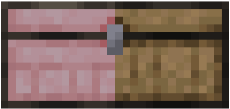

# Mismatched chests

Mismatched Chests is a simple mod that allows you to combine two chests of different wood types to create a double chest, as if they were the same. It's designed to work with other mods that add new chests, such as [LieOnLion's More chest variants mod](https://modrinth.com/mod/more-chest-variants-lieonlion) , so you can have an oak chest, and a cherry chest side-by-side and still have them function as a single, double chest!

## Features
- Create a double chest using any two chests
- The mod works with any mod that adds new chests, as long as they extend the `ChestBlock` class.

## Installation
- Download [fabric 1.21+](https://fabricmc.net/use/installer/) from fabricmc
- Download [Mismatched chests](https://modrinth.com/mod/mismatched-chests)  from Modrinth or the [GitHub releases](https://github.com/NotGhoull/mismatched-chests/releases) 
- Place the downloaded `.jar` file in your `mods` folder
- Launch and enjoy!

## Compatibility
Mismatched chests should work with any extra chest mod, however is there are any issues please [report them](https://github.com/NotGhoull/mismatched-chests/issues/new), and we'll try to fix them.

## Licence
This mod is open source and licensed under the **GPLv3 licence**. Feel free to fork the repository, make changes, and submit PRs!
## Tested mods
- [More chest variants | LieOnLion](https://modrinth.com/mod/more-chest-variants-lieonlion) 

## Known incompatibilities
- Sophisticated Storage (Currently being worked on)

## Credits
- Ghoul _"Look ma, I'm on TV"_ - Developer
